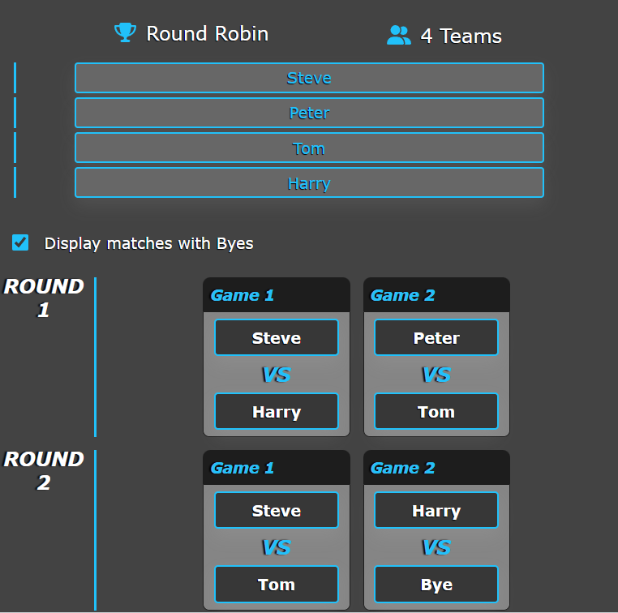

# Tournament Generator [](https://opensource.org/licenses/MIT)

## Links
- [GitHub](https://github.com/seanscott95/round-robin-generator)
- Create a tournament here at [Tournament Generator](https://tournament-generator.netlify.app)

## Description
<p>This application allows the user to create a tournament from of of the three options: Round Robin, Single Elimination or Double Elimination. Round Robin tournament is the only current functioning tournament.
</p>

<p>This application was created with JavaScript and included the following technologies:</p>

- [React.js](https://reactjs.org/)

- [Node.js](https://nodejs.org/en/)

- [React-Router](https://reactrouter.com/en/main)

    
## Table of Contents 
- [Screenshots](#Screenshots)
- [Installation](#Installation)
- [License](#License)
- [Questions](#Questions)

## Screenshots

<p>Leaderboard Page</p>

- 

## Installation
<p>If you would like to download the application please follow these instructions:
</p>

- Please have Node.js and npm installed.

- To start, clone this repository by using the following command:

 ```
  git clone git@github.com:seanscott95/round-robin-generator.git
 ```

- In your terminal navigate to the cloned repository and run ```npm run install``` to install the node modules needed for this application.

- Then enter ```npm run develop``` to start the application.

- If your browser doesn't open straight away you can search for it using the url ```http//:localhost:3000```


## License 
<p> This application is covered under the:</p>

- [MIT-License](https://opensource.org/licenses/MIT)

## Questions 
<p> To reach me with additional questions please contact me via one of the following methods: </p>

- [GitHub](https://github.com/seanscott95)
- [Email](mailto:seanms418@gmail.com)
- [LinkedIn](https://www.linkedin.com/in/sean-scott-18ba07225/)