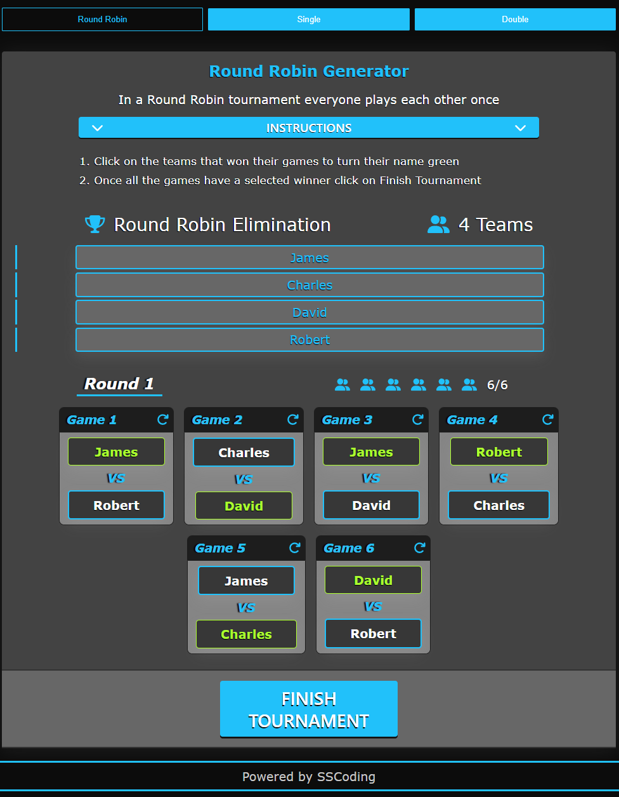

# Tournament Generator [](https://opensource.org/licenses/MIT)

## Links
- [GitHub](https://github.com/seanscott95/round-robin-generator)
- Create a tournament here at [Tournament Generator](https://tournament-generator.netlify.app)

## Description
<p>This application allows the user to create a tournament from one of the three options: Round Robin, Single Elimination or Double Elimination. Single and Double elimination tournaments contain a special feature that allows you to have as many teams as you want. Generally these tournaments have to be 4, 8, 16, 32 etc teams long.
</p>

<p>This application was created with JavaScript and included the following technologies:</p>

- [React.js](https://reactjs.org/)

- [Node.js](https://nodejs.org/en/)

- [React-Router](https://reactrouter.com/en/main)

- [SASS](https://sass-lang.com/)

    
## Table of Contents 
- [Screenshots](#Screenshots)
- [Installation](#Installation)
- [License](#License)
- [Questions](#Questions)

## Screenshots

<p>Homepage</p>

- 

<p>Round Robin</p>

- 

<p>Round Robin Generated</p>

- 

<p>Round Robin Selected Winners</p>

- 

<p>Round Robin Tournament Over</p>

- 

<p>Single Elimination</p>

- 

<p>Single Elimination Round 2</p>

- 

<p>Double Elimination Tournament Over</p>

- 

<p>Settings</p>

- 

<p>Team Limit Off</p>

- 

<p>Team Limit Off Tournament Over</p>

- 

## Installation
<p>If you would like to download the application please follow these instructions:
</p>

- Please have Node.js and npm installed.

- To start, clone this repository by using the following command:

 ```
  git clone git@github.com:seanscott95/tournament-generator.git
 ```

- In your terminal navigate to the cloned repository and run ```npm run install``` to install the node modules needed for this application.

- Then enter ```npm run dev``` to start the application.

- If your browser doesn't open straight away you can search for it using the url ```http://127.0.0.1:5173/```

## Usage
- To get started click on one of the tournament options.
- Enter the team names into the team input and click ADD or press Enter to add the team name.
- Once all team names have been added click the Generate button to start the tournament.
- To choose a winner click on the winning team in the game card to turn the winning teams name green.
- Once all games have a winner click on the Next Round and repeat the process for Single and Double elimination tournaments or click Finish Tournament if is is a Round Robin Tournament.
- For more instructions please check the tournaments page.

## License 
<p> This application is covered under the:</p>

- [GNU-GPLv3-License](https://opensource.org/license/gpl-3-0/)

## Questions 
<p> To reach me with additional questions please contact me via one of the following methods: </p>

- [GitHub](https://github.com/seanscott95)
- [Email](mailto:seanms418@gmail.com)
- [LinkedIn](https://www.linkedin.com/in/sean-scott-18ba07225/)